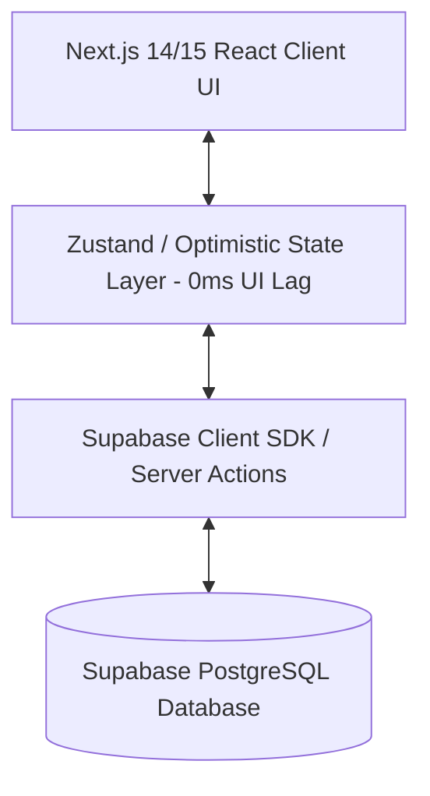

# Implementation Plan - Personal Expense & Inflow Tracker

A full-stack, lag-free, daily expense and income management application with bank account opening balances, transfer tracking, and visual analytics, powered by **Next.js (App Router)** and **Supabase (PostgreSQL)**.

---

## 1. System Architecture



### Key Technical Decisions:
1. **Frontend / Framework:** Next.js (App Router) + Tailwind CSS + Lucide Icons + Recharts.
2. **Database:** Supabase (PostgreSQL) Free Tier (500MB, unlimited API requests, automatic SSL & backups).
3. **Performance Strategy (Zero Lag):**
   - **Optimistic UI Updates:** State updates instantly in local memory before the Supabase network call finishes.
   - **Offline-ready / Fallback Mode:** Seamless local storage fallback when Supabase keys are not yet configured during local testing.
4. **Free Deployment:** 1-Click deploy on Vercel connected to Supabase free project.

---

## 2. Supabase Database Schema (PostgreSQL)

```sql
-- 1. Accounts Table (Bank accounts, wallets, credit cards)
CREATE TABLE IF NOT EXISTS accounts (
    id UUID PRIMARY KEY DEFAULT gen_random_uuid(),
    name VARCHAR(100) NOT NULL,
    type VARCHAR(50) NOT NULL DEFAULT 'Checking', -- Checking, Savings, Credit Card, Cash, Wallet
    currency VARCHAR(10) NOT NULL DEFAULT 'INR', -- or USD, EUR, etc.
    color VARCHAR(20) DEFAULT '#3B82F6',
    initial_balance DECIMAL(12, 2) NOT NULL DEFAULT 0.00,
    created_at TIMESTAMPTZ DEFAULT NOW(),
    updated_at TIMESTAMPTZ DEFAULT NOW()
);

-- 2. Monthly Balances Table (Tracks starting/opening balance per month)
CREATE TABLE IF NOT EXISTS monthly_balances (
    id UUID PRIMARY KEY DEFAULT gen_random_uuid(),
    account_id UUID REFERENCES accounts(id) ON DELETE CASCADE,
    month VARCHAR(7) NOT NULL, -- Format: YYYY-MM (e.g. 2026-10)
    opening_balance DECIMAL(12, 2) NOT NULL DEFAULT 0.00,
    notes TEXT,
    created_at TIMESTAMPTZ DEFAULT NOW(),
    updated_at TIMESTAMPTZ DEFAULT NOW(),
    UNIQUE(account_id, month)
);

-- 3. Categories Table
CREATE TABLE IF NOT EXISTS categories (
    id UUID PRIMARY KEY DEFAULT gen_random_uuid(),
    name VARCHAR(100) NOT NULL,
    type VARCHAR(20) NOT NULL, -- 'EXPENSE' or 'INCOME'
    icon VARCHAR(50) DEFAULT 'Tag',
    color VARCHAR(20) DEFAULT '#6B7280',
    created_at TIMESTAMPTZ DEFAULT NOW()
);

-- 4. Transactions Table (Expenses, Income/Credits, Account Transfers)
CREATE TABLE IF NOT EXISTS transactions (
    id UUID PRIMARY KEY DEFAULT gen_random_uuid(),
    type VARCHAR(20) NOT NULL, -- 'EXPENSE' (Debit), 'INCOME' (Credit), 'TRANSFER'
    amount DECIMAL(12, 2) NOT NULL,
    account_id UUID REFERENCES accounts(id) ON DELETE CASCADE,
    to_account_id UUID REFERENCES accounts(id) ON DELETE SET NULL, -- Used only when type is 'TRANSFER'
    category_id UUID REFERENCES categories(id) ON DELETE SET NULL,
    date DATE NOT NULL DEFAULT CURRENT_DATE,
    note TEXT,
    payment_mode VARCHAR(50) DEFAULT 'Online', -- Cash, Card, UPI, Net Banking, Cheque
    created_at TIMESTAMPTZ DEFAULT NOW(),
    updated_at TIMESTAMPTZ DEFAULT NOW()
);

-- Indexes for lightning fast queries
CREATE INDEX IF NOT EXISTS idx_transactions_date ON transactions(date);
CREATE INDEX IF NOT EXISTS idx_transactions_account ON transactions(account_id);
CREATE INDEX IF NOT EXISTS idx_monthly_balances_month ON monthly_balances(month);
```

---

## 3. Balance Calculation Engine

$$\text{Current Account Balance} = \text{Initial Balance} + \sum \text{Credits (Income)} - \sum \text{Debits (Expenses)} + \sum \text{Transfers In} - \sum \text{Transfers Out}$$

$$\text{Monthly Starting Balance for Month } M = \begin{cases} 
\text{Manual Override Balance if configured for Month } M \\ 
\text{or } \text{Closing Balance of Month } M-1 
\end{cases}$$

---

## 4. Phase-by-Phase Implementation Roadmap

### **Phase 1: Project Setup & Database Layer**
- [x] Create implementation plan (`implementationplan.md`).
- [x] Initialize Next.js project with Tailwind CSS & Lucide Icons.
- [x] Setup Supabase client SDK (`@supabase/supabase-js`), types, and SQL migration schema.
- [x] Create mock/local storage fallback provider so the app works out-of-the-box even before Supabase API keys are inserted.

### **Phase 2: Bank Account & Opening Balance Engine**
- [x] Account Manager UI: Add/Edit/Delete Bank Accounts (e.g., *HDFC Salary, SBI Savings, Cash in Hand, Amex*).
- [x] Monthly Starting Balance Editor: View and set starting balance for the current/selected month per account.
- [x] Live Net-Worth & Liquid Balance calculation engine.

### **Phase 3: Fast Transaction Engine (Credits, Debits & Transfers)**
- [x] Rapid-Entry modal/drawer (<5 seconds logging):
  - **Expense (Debit):** Amount, Bank Account, Category, Note, Date.
  - **Income (Credit):** Amount, Credited-To Bank Account, Source/Category, Note, Date.
  - **Transfer:** Amount, From Account, To Account, Note, Date.
- [x] Optimistic state updates for instant zero-lag response.

### **Phase 4: Dashboard, Analytics & Ledger**
- [x] Monthly Financial Summary Cards:
  - Total Monthly Inflow (Credits)
  - Total Monthly Outflow (Debits)
  - Net Savings / Surplus
  - Total Available Liquid Balance
- [x] Filterable & searchable transaction ledger (filter by account, type, category, date range).
- [x] Interactive Charts:
  - Inflow vs Outflow timeline.
  - Category-wise expense breakdown.
  - Account distribution donut chart.

### **Phase 5: CSV Export, Backup & Free Deployment Setup**
- [x] CSV Export for transactions and monthly balances.
- [x] Comprehensive `.env.example` and Supabase SQL setup script.
- [x] Vercel 1-click deploy configuration.

---

## 5. Free Deployment Instructions (Vercel + Supabase)

1. **Supabase (Free DB):**
   - Create a free project at [supabase.com](https://supabase.com).
   - Run the provided `schema.sql` in the Supabase SQL Editor.
   - Copy `NEXT_PUBLIC_SUPABASE_URL` and `NEXT_PUBLIC_SUPABASE_ANON_KEY`.

2. **Vercel (Free Hosting):**
   - Push code to GitHub and connect repository to [vercel.com](https://vercel.com).
   - Add environment variables `NEXT_PUBLIC_SUPABASE_URL` and `NEXT_PUBLIC_SUPABASE_ANON_KEY`.
   - Deploy!
